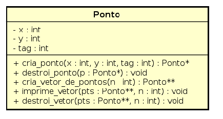
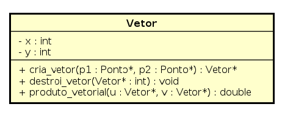

Tenho medo do que traz aqui! Sobretudo se você for o Léo

### Breve descrição do problema
Dados dois pontos-âncoras $A = (x_a, 0)$ e $B = (x_b, 0)$ e um conjunto de pontos $\mathbb{P}$, qual a maior sequência possível de segmentos tais que os segmentos $\overline{Ap}$ e $\overline{pB}$ $\ \forall p \in \mathbb{P}$ se interceptem apenas nos pontos-âncoras.

Pela definição do problema, garantimos as seguintes restrições: $0 < p_x$ e $0 <  p_y < 10^4 \ \forall p \in \mathbb{P}$ e $0 < X_a < X_b < 10^4$.

### Natureza geométrica do problema

Determinar se dois segmentos de reta se interceptam é um problema clássico de geometria computacional \citep{Cormen2009}. Um algoritmo que implementa uma técnica para resolvê-lo é conhecido como \textit{Varredura}.  

Nossa abordagem, no entanto, se baseia em conclusões geométricas a respeito da avaliação de um triângulo determinado pelos pontos-âncora e um ponto genérico $p \in \mathbb{P}$. 

A imagem a seguir, mostra os pontos de um conjunto $\mathbb{P}_1 = \{C(3,4), D(3,2), E(7,4)\}$. Para determinarmos se há intersecção entre os pontos $C$ e $E$, olhamos para o os triângulos determinados pelos pontos $ACB$ e $AEB$. A intersecção acontecerá se o ponto $E$ não estiver contido no triângulo $ACB$ \textbf{ou} se o ponto $C$ não estiver contido no triângulo $AEB$.

Se fixarmos o ponto $D$ e compararmo-lo aos pontos $C$ e $E$, temos que $D \subset ACB$ e $D \not\subset AEB$.

Perceba, no entanto, que contar quantos pontos um triângulo $\Delta ABp_i$ contém e tomar o máximo dentre todas as possibilidades não é suficiente, uma vez que dois pontos $p_1$ e $p_2$ podem não formar uma sequência entre si. A imagem a seguir ilustra essa situação. 

Os pontos $D$ e $E$ não formam uma sequência válida entre si. Se contássemos quantos pontos $\Delta ABC$ contém, encontraríamos 2 como resposta. No entanto, há apenas um arranjo que respeita nossa restrição.  

Para solucionar esse problema, adotamos a seguinte abordagem: para um ponto genérico $p_i$, contamos quantos pontos subjacentes (\textit{i.e.}, contidos em $\Delta ABp_i$) ele contém. Se ele não contém nenhum, adicionamos uma flag em $p_i$ que passa a valer 1 (uma sequência válida). Por outro lado, se ele contém pelo menos um ponto abaixo de si, analisamo-o com todos os pontos anteriores $p_j tal \ que \ 0 < j < i$. Se $p_j$ está dentro de $p_i$, setamos uma variável auxiliar que vale $1 + p_j.tag$ (todas as sequências válidas mais essa). Se a variável auxiliar for maior do que a tag do ponto $p_i$, então atualizamo-a com o valor da variável auxiliar. 

Por fim, analisamos para o ponto $p_i$ se sua tag é maior do que o a sequência máxima até aquele momento. Caso seja, a sequência máxima passa ser a tag do ponto $p_i$. 

### Estruturas de Dados
Para modelarmos o problema, utilizamos os Tipos Abstratos de Dados apresentados na figura 3.

O TAD Ponto é o principal tipo utilizado no programa. Essa acepção não só é verdadeira, como elegante, já que dos postulados euclidianos, sabemos: 

	1. *``Fique postulado traçar uma reta a partir de todo ponto até todo ponto".* (Euclides) 
 		De forma geral, ``dois pontos distintos determinam uma reta". 
	
	2.  *``Figuras retilíneas são as contidas por retas, por um lado, triláteras, as por três [...]"*. Euclides. 
  		Dessa definição e de outros postulados segue a famosa expressão: \textit{``três pontos não todos colineares determinam um triângulo"}.

Outra estrutura de dados importante é o tipo Vetor. De acordo com \citet{boulos2010}, a cada ponto $P \in E^3$ e a cada vetor $\vec{v} \in V^3$, a soma de $P$ com $\vec{v}$ é definida em termos de um único representante de $\vec{v} \in V^3$: o segmento orientado $(P, Q)$. Segue: 
	$$P + \overline{PQ} = Q$$	
	$$P + \vec{v} = Q$$
Somando $-P$ dos dois lados, temos: 
	$$\vec{v} = Q - P$$
Se sabemos as componentes *x e y* de Q e P em uma base qualquer de $E^3$, podemos definir o vetor apenas subtraindo essas componentes. Nosso programa usa essa abordagem para instanciar um TAD $Vetor$.

Usamos esse resultado pois sabemos da álgebra linear que dado dois vetores $\vec{u}, \vec{v} \in V^3$, o produto vetorial euclidiano $\vec{u} \times \vec{v}$ determina a área do paralelogramo contido entre eles. \citet{anton2012}. Calcular área de um triângulo é algo primordial para uma de nossas funções.

Para determinamos se um ponto $p_i$ está dentro de um triângulo $\Delta ABP$, verificamos se $| \Delta ABP |\footnote{Notação: $|\Delta A| =$ área do triângulo A} = |\Delta APp_i| + |\Delta ABp_i| + |\Delta PBp_i|$.

Com o resultado anterior, basta fazer o produto vetorial dos três vetores e verificar o valor se suas somas é igual ao produto vetorial do triângulo mais externo. 

Note que: 
$$| \Delta ABP | = \vec{AP} \times \vec{BP} $$
$$| \Delta ABp_i | = \vec{Ap_i} \times \vec{Pp_i} $$
$$| \Delta APp_i | = \vec{AP} \times \vec{Ap_i} $$
$$| \Delta PBp_i | = \vec{Bp_i} \times \vec{Pp_i} $$

Se $| \Delta ABP |$ for igual à soma dos demais vetoriais, então sabemos que o ponto $p_i$ está contido em $\Delta ABP$.\\

