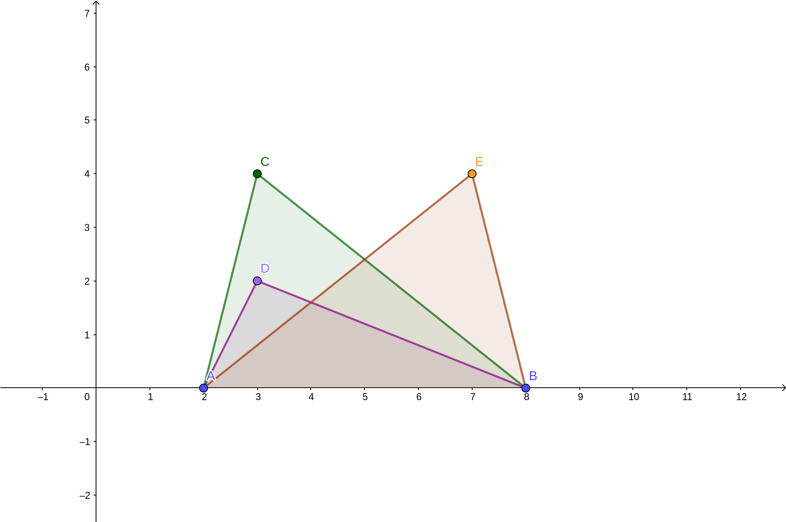
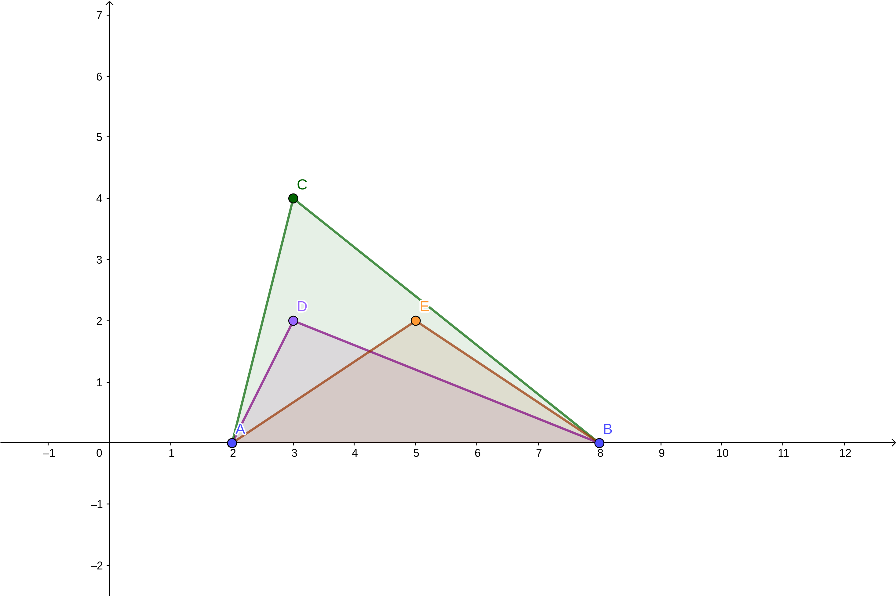
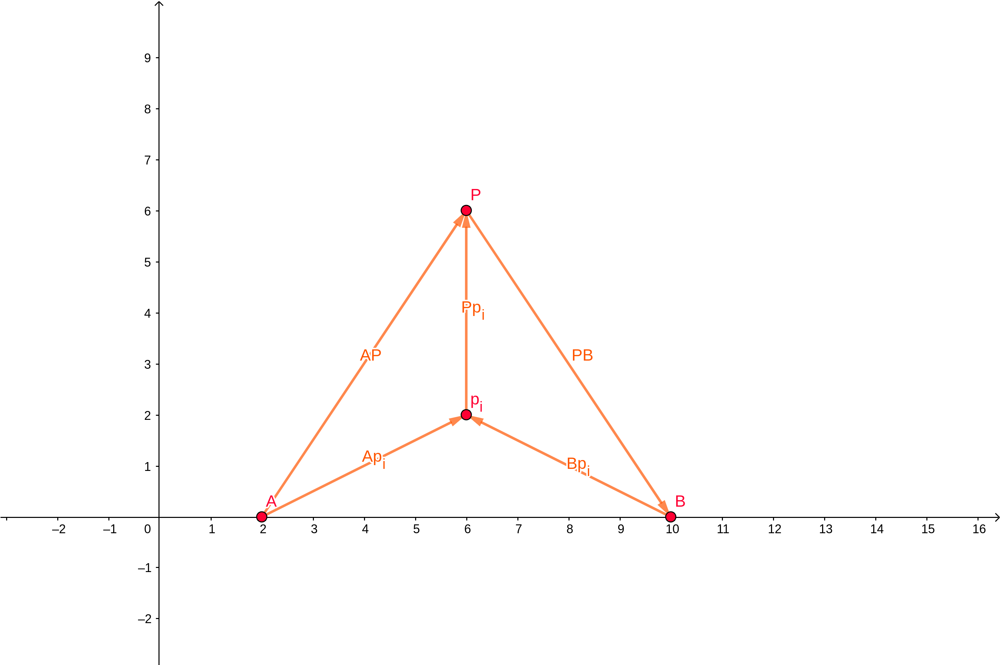
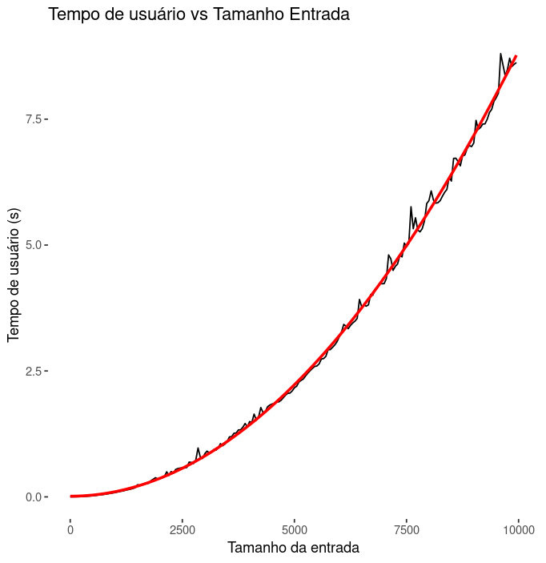

Tenho medo do que traz aqui! Sobretudo se você for o Léo

### Breve descrição do problema
Dados dois pontos-âncoras $A = (x_a, 0)$ e $B = (x_b, 0)$ e um conjunto de pontos $\mathbb{P}$, qual a maior sequência possível de segmentos tais que os segmentos $\overline{Ap}$ e $\overline{pB}$ $\ \forall p \in \mathbb{P}$ se interceptem apenas nos pontos-âncoras?

Pela definição do problema, garantimos as seguintes restrições: $0 < p_x$ e $0 <  p_y < 10^4 \ \forall p \in \mathbb{P}$ e $0 < X_a < X_b < 10^4$.

### Natureza geométrica do problema

Pontos

Restrição

O TAD Ponto é o principal tipo utilizado no programa. Essa acepção não só é verdadeira, como elegante, já que dos postulados euclidianos, sabemos: 

	1. *``Fique postulado traçar uma reta a partir de todo ponto até todo ponto".* (Euclides) 
 		De forma geral, ``dois pontos distintos determinam uma reta". 
	
	2.  *``Figuras retilíneas são as contidas por retas, por um lado, triláteras, as por três [...]"*. Euclides. 
  		Dessa definição e de outros postulados segue a famosa expressão: \textit{``três pontos não todos colineares determinam um triângulo"}.

De acordo com Boulos (2010), a cada ponto $P \in E^3$ e a cada vetor $\vec{v} \in V^3$, a soma de $P$ com $\vec{v}$ é definida em termos de um único representante de $\vec{v} \in V^3$: o segmento orientado $(P, Q)$. Segue: 
	$$P + \overline{PQ} = Q$$	
	$$P + \vec{v} = Q$$
Somando $-P$ dos dois lados, temos: 
	$$\vec{v} = Q - P$$
Se sabemos as componentes *x e y* de Q e P em uma base qualquer de $E^3$, podemos definir o vetor apenas subtraindo essas componentes. Nosso programa usa essa abordagem para instanciar um TAD $Vetor$.

Usamos esse resultado pois sabemos da álgebra linear que dado dois vetores $\vec{u}, \vec{v} \in V^3$, o produto vetorial euclidiano $\vec{u} \times \vec{v}$ determina a área do paralelogramo contido entre eles. \citet{anton2012}. Calcular área de um triângulo é algo primordial para uma de nossas funções.

Para determinamos se um ponto $p_i$ está dentro de um triângulo $\Delta ABP$, verificamos se 
$$| \Delta ABP | = |\Delta APp_i| + |\Delta ABp_i| + |\Delta PBp_i|$$

Com o resultado anterior, basta fazer o produto vetorial dos três vetores e verificar o valor se suas somas é igual ao produto vetorial do triângulo mais externo. 

Note que: 
$$| \Delta ABP | = \vec{AP} \times \vec{BP} $$
$$| \Delta ABp_i | = \vec{Ap_i} \times \vec{Pp_i} $$
$$| \Delta APp_i | = \vec{AP} \times \vec{Ap_i} $$
$$| \Delta PBp_i | = \vec{Bp_i} \times \vec{Pp_i} $$

Se $| \Delta ABP |$ for igual à soma dos demais vetoriais, então sabemos que o ponto $p_i$ está contido em $\Delta ABP$.\\

### Complexidade
O comportamento da curva condiz com um programa de complexidade $O(n^2)$. Obtivemos a função de regressão descrita a seguir, com a não significância de $\beta_0$ e $\beta_1$ ao nível de $0,05$: 
$$\hat{f}(n) = 8,830528\cdot 10^{-8}n^2 \ (em \ segundos)$$
$$R^2 = 0.9982$$

#### Tempo de execução para o maior caso de teste é muito grande

Se tomarmos o tempo das 10 mil primeiras execuções, encontramos o tempo total que duraria o teste. Como estimamos a função de complexidade $\hat{f}(n)$, podemos integrar no intervalo descrito e assim sabemos que o tempo gasto seria da seguinte ordem: 
$$\int_{0}^{10k} \hat{f}(n) \ dn = 8h10min$$.

